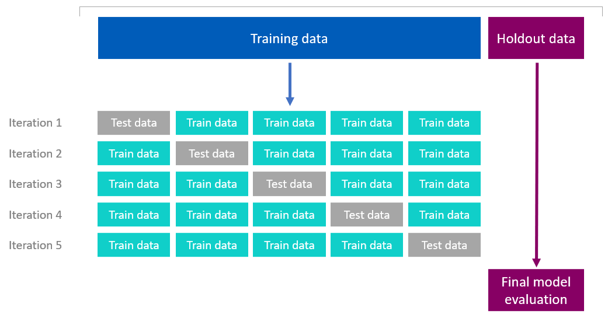

# Practical Application 2 - Used Cars Price Prediction

[Notebook link](https://github.com/benharosh/practical_application_2/blob/main/Vehicles.ipynb)
[Github Dev notebook link](https://github.dev/benharosh/practical_application_2/blob/main/Vehicles.ipynb)

**OVERVIEW**

In this application, we will explore a dataset from kaggle. The original dataset contained information on 3 million used cars. The provided dataset contains information on 426K cars to ensure speed of processing.  The goal is to understand what factors make a car more or less expensive.  As a goal we should provide clear recommendations to your client -- a used car dealership -- as to what consumers value in a used car.

### Business Understanding

From a business perspective, we are tasked with identifying key drivers for used car prices.  In the CRISP-DM overview, we are asked to convert this business framing to a data problem definition. 

 Business Objectives:
 * Dealerships want identify what features in used cars will drive the price of the car up
 * Dealerships want to have good understanding of what price should they pay for a certain car with certain features, in order to maximize their ability to make profit by buying cars under market value and making profit
 * Dealerships want to identify which used cars they should stay away from

 Assess Situation -  Assumptions:
* Normally, car year and odometer are the leading factors when assesing used car price. That should suggest that entries without this data pieces should be removed, since we do not want to artificially impute this data, which can lead to inaccurate predictions
* Used cars prices trend in two directions - prices normally go down when car year gets old, but then in some point old cars become collector cars and then the price of the used car strats to go up as the car is older behind that point
* The better the condition of the car is, the higher the expected used car price should be. Hence, records without condition data, should be treated cautiously
 
### Data Understanding

After considering the business understanding, we want to get familiar with our data.  We'll explore the steps that we would take to get to know the dataset and identify any quality issues within. 

* Data has 426K records
* Data has 3 numerical and 13 categorical columns
* Data contain many rows with NaN values. 7 columns are missing more than `20%` of their values
* Over 90% of cars are prices between `500` to `100,000` USD
* `price` data is skewed and we might want to work with the price log that shows a better uniform distribution
* There are many `price` outliers - over 35K records with price=0 and some cars with prices ober 1 billion dollar
* There are some `odometer` outliers - cars with over 500K miles, some of them with 10 million miles
* There are many duplicate records (almost 200,000) - cars that has the same `VIN ` number with the same odometer, price, mode and  manufactor
* `cylinders` and `condition ` categorical columns can show ordinallity when ranking their unique values

### Data Cleaning 
* I dropped the `id` column since it's holding a unique identifier that has no predictive meaning
* I dropped the `size` column since it's missing more than `70%` of its data
* I dropped over 199K duplicated records, most of them related to cars with the same `VIN` number that had the same features as `price`, `odometer` and `year`
* I dropped the `VIN` column after cleaning the dulicates, since it's just holding a unique identifier that has no predictive meaning
* I remove `odometer` outliers and focused on cars with `odometer` which is less than 400K miles that captured most  (`98.5%`) of the data set
* I remove `price` outliers and focused on cars with `price` between 500 and 100,000 USD that captured most (`91.05%`) of the data set
* I removed all `title_status` besides `clean` in order to focus on predicting cars with clean titles. I did it since `clean` title status captures `93.77%` of the data set
* I removed rows that were missing more than 4 values out of the coluns that showed the highest missing values - `condition`, `paint_color`, `drive`, `cylinders` and `type` columns
* I removed rows that contained `other` value and treated it as a missing value (NaN)
* I removed NaN values for colums with less than 4% of missing values `year`, `odometer`, `manufacturer`, `fuel`, `transmission` . For `year`, `odometer` it made a very good sense because these columns were very highly correlated to the price and it didn't make sense to randomly impute them

#### Data imputation approach
* I imputed the missing data for the remained NaNs with `RandomSampleImputer`. I chose this imputer because it's fast and keeping the same distribution of data before and after imputation, which is very important when imputing 20-30% of missing data
* After cleaning, and NaNs imputation, we were left with ~146K rows - `34.4%` of the original data set

#### Removing all missing values approach
 I wanted to compare the performance of model that were built on the imputated data to models that we'll built on top of data without imputation - we will only use rows that don't contain NaN or missing values (as the other value). The logic behind this approach, is that since the original data set included many NaNs for many columns, the imputation process generated big chunk of syntetic data values, that might affect the prediction results.

* Removed NaN values for all colums that contained NaN values
* After cleaning, and NaNs imputation, we were left with ~146K rows - `34.4%` of the original data set
* I removed rows that contained `other` value and treated it as a missing value (NaN)
* We were left with 65K records after the data cleanup, which are `15.2%` from the original data set 

### Modelling
With our final datasets in hand - the one with data imputation, and the one with remove all NaNs - we'll now build some models. We'll build a number of different regression models (Ridge, LinearRegression and Lasso) with the price as the target. In building the models, we'll explore different hyper parameters and cross-validate our findings with K-Fold cros-validation on the training data. We'll also conduct a Holdout cross-validation on the best model the K-folded suggested with different sizes of hold-out set (80/20, 72/25, 70/30).
We'll also explore feature selection and compare model performance results.

### Findings
From the above results, the data shows that the main features that drive the car price were: year, odometer, fuel type, number of cylinders and type of the car are the most important features for predicting car price.

Year and odometer were the most dominant features, so when looking at buying used cars for the delaership, we'd recommend buying newer cars and car with low odometer.
We'd also stay away from cars with high odometer and old cars (older than 10 years and up until 1980).

For collector cars (older than 1970), it's very hard to predict their price based on the year (the correlation between year and price is very weak). Hence, odometer and condition should play a bigger role.

Data also show that number of cylinders (more cylinders the higher the price), and type of the car (4wd) and the fuel type (diesel), play a role with driving the price up, so it's worth highlighting these featues when selling a used car, and pay attention to these details when pricing used cars. 
